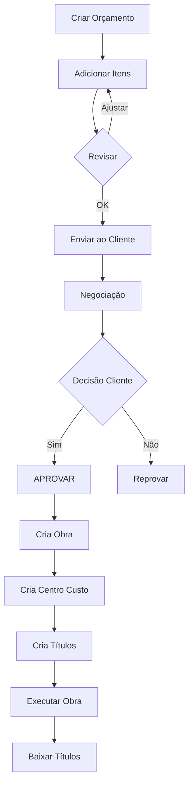

# 💼 MÓDULO VENDAS / ORÇAMENTOS

Sistema comercial completo para fábrica de esquadrias com **geração automática de obras e títulos**.

---

## 🎯 VISÃO GERAL

Este módulo gerencia todo o ciclo comercial:

```
ORÇAMENTO → PROPOSTA → APROVAÇÃO → OBRA + TÍTULOS
```

### Principais Funcionalidades

✅ **Orçamentos Profissionais**
- Cadastro completo de orçamentos
- Itens com dados técnicos (largura, altura, cor, linha, vidro)
- Cálculo automático de totais
- Condições de pagamento flexíveis

✅ **Aprovação Automática**
- Ao aprovar orçamento, cria automaticamente:
  - 🏗️ **Obra** (módulo projetos)
  - 💰 **Centro de Custo**
  - 📋 **Títulos a Receber** (conforme condição de pagamento)

✅ **Relatórios Comerciais**
- Funil de vendas
- Taxa de conversão por vendedor
- Backlog de obras

✅ **Propostas em PDF**
- Geração de propostas profissionais
- Versionamento
- Histórico de envios

---

## 📦 ESTRUTURA

```
vendas/
├── models.py                  # 5 models Django
│   ├── CondicaoPagamento      # À vista, parcelado, entrada+parcelas, medição
│   ├── Orcamento              # Orçamento principal
│   ├── OrcamentoItem          # Itens do orçamento
│   ├── OrcamentoAnexo         # PDF, plantas, fotos
│   └── OrcamentoHistorico     # Audit trail
│
├── services.py                # Regras de negócio
│   ├── OrcamentoService       # CRUD + Aprovação
│   └── RelatorioComercialService
│
├── views.py                   # Views e APIs
│   ├── orcamento_list         # Listar com filtros
│   ├── orcamento_create       # Criar novo
│   ├── orcamento_edit         # Editar
│   ├── orcamento_detail       # Detalhes
│   ├── orcamento_aprovar      # Aprovação (cria obra)
│   ├── orcamento_reprovar
│   └── relatorios/            # Funil, conversão, backlog
│
├── urls.py                    # Rotas
├── admin.py                   # Admin Django
│
└── templates/vendas/
    ├── orcamento_list.html
    ├── orcamento_create.html
    ├── orcamento_edit.html
    ├── orcamento_detail.html
    └── relatorios/
```

---

## 🚀 INÍCIO RÁPIDO

### 1. Instalar Módulo

```bash
# Adicionar ao INSTALLED_APPS
INSTALLED_APPS = [
    # ...
    'vendas',
]

# Adicionar URLs
urlpatterns = [
    path('vendas/', include('vendas.urls')),
]

# Migrar banco
python manage.py makemigrations vendas
python manage.py migrate vendas
```

### 2. Configurar Dados Básicos

```python
# Shell Django
python manage.py shell
```

```python
from financeiro.models import PlanoContas
from vendas.models import CondicaoPagamento

# Criar Plano de Contas (OBRIGATÓRIO)
PlanoContas.objects.create(
    codigo='3.1.01',
    nome='Receita de Vendas',
    tipo='RECEITA'
)

# Criar Condição Padrão (À Vista)
CondicaoPagamento.objects.create(
    codigo='AV',
    descricao='À Vista',
    tipo='A_VISTA',
    numero_parcelas=1,
    padrao=True
)
```

### 3. Usar Interface Web

```
http://localhost:8000/vendas/orcamentos/
```

---

## 💡 EXEMPLOS DE USO

### Criar Orçamento

```python
from vendas.services import OrcamentoService
from cadastros.models import Pessoa, Produto
from vendas.models import CondicaoPagamento
from django.contrib.auth import get_user_model
from decimal import Decimal

User = get_user_model()

# Dados
cliente = Pessoa.objects.get(nome_razao__icontains='João')
vendedor = User.objects.first()
condicao = CondicaoPagamento.objects.get(codigo='AV')

# Criar
orcamento = OrcamentoService.criar_orcamento(
    cliente=cliente,
    vendedor=vendedor,
    condicao_pagamento=condicao,
    criado_por=vendedor
)

# Adicionar itens
produto = Produto.objects.first()
OrcamentoService.adicionar_item(
    orcamento=orcamento,
    produto=produto,
    quantidade=Decimal('2.0'),
    preco_unitario=Decimal('1500.00'),
    largura=Decimal('1.20'),
    altura=Decimal('1.50'),
    cor='Branco',
    linha='Suprema',
    vidro='Incolor 4mm'
)

print(f"Orçamento {orcamento.numero} criado! Total: R$ {orcamento.total}")
```

### Aprovar Orçamento (MÁGICA!)

```python
# Enviar ao cliente
OrcamentoService.mudar_status(
    orcamento=orcamento,
    novo_status='ENVIADO',
    usuario=vendedor
)

# APROVAR (cria obra + títulos automaticamente!)
obra = OrcamentoService.aprovar_orcamento(
    orcamento=orcamento,
    usuario=vendedor,
    observacao="Cliente confirmou por email"
)

print(f"Obra criada: {obra.codigo}")
print(f"Centro de Custo: {obra.centro_custo.nome}")

# Verificar títulos criados
titulos = obra.titulos_receber.all()
print(f"{titulos.count()} título(s) criado(s):")
for titulo in titulos:
    print(f" - {titulo.numero}: R$ {titulo.valor_original} (Vencto: {titulo.data_vencimento})")
```

**Resultado:**
```
Obra criada: OBR-2025-0001
Centro de Custo: CC-OBR-2025-0001 - João da Silva - ORC-2025-0001
1 título(s) criado(s):
 - ORC-2025-0001-1/1: R$ 3000.00 (Vencto: 2025-01-15)
```

---

## 📊 RELATÓRIOS

### Funil de Vendas

```python
from vendas.services import RelatorioComercialService
import datetime

funil = RelatorioComercialService.funil_vendas(
    data_inicio=datetime.date(2025, 1, 1),
    data_fim=datetime.date(2025, 12, 31)
)

for etapa in funil:
    print(f"{etapa['status']}: {etapa['quantidade']} orçamentos (R$ {etapa['valor_total']})")
```

### Taxa de Conversão por Vendedor

```python
conversao = RelatorioComercialService.taxa_conversao_vendedor(
    data_inicio=datetime.date(2025, 1, 1),
    data_fim=datetime.date(2025, 12, 31)
)

for v in conversao:
    print(f"{v['first_name']}: {v['taxa_conversao']}% ({v['total_aprovados']}/{v['total_orcamentos']})")
```

---

## 🎨 CONDIÇÕES DE PAGAMENTO

### Tipos Suportados

#### 1. À Vista
```python
CondicaoPagamento.objects.create(
    codigo='AV',
    descricao='À Vista',
    tipo='A_VISTA',
    numero_parcelas=1,
    primeira_parcela_dias=0
)
# Gera: 1 título no valor total
```

#### 2. Parcelado
```python
CondicaoPagamento.objects.create(
    codigo='3X',
    descricao='3x sem juros',
    tipo='PARCELADO',
    numero_parcelas=3,
    intervalo_dias=30,
    primeira_parcela_dias=30
)
# Gera: 3 títulos iguais (30, 60, 90 dias)
```

#### 3. Entrada + Parcelas
```python
CondicaoPagamento.objects.create(
    codigo='ENT3X',
    descricao='30% Entrada + 3x',
    tipo='ENTRADA_PARCELAS',
    percentual_entrada=Decimal('30.00'),
    numero_parcelas=3,
    intervalo_dias=30,
    primeira_parcela_dias=0
)
# Gera: 1 entrada (30%) + 3 parcelas (70% / 3)
```

#### 4. Medição de Obra
```python
CondicaoPagamento.objects.create(
    codigo='MED3',
    descricao='Medição 30-40-30',
    tipo='MEDICAO',
    medicoes_percentuais=[30, 40, 30],  # JSON
    intervalo_dias=30,
    primeira_parcela_dias=0
)
# Gera: 3 títulos (30%, 40%, 30% do total)
```

---

## 🔒 VALIDAÇÕES

### Validação de Cliente

Antes de criar orçamento, valida:

```python
from vendas.services import OrcamentoService

is_valid, erros = OrcamentoService.validar_cliente_orcamento(cliente)

if not is_valid:
    print("Erros:", erros)
    # ['Cliente sem telefone de contato', 'Cliente sem email']
```

### Validação de Aprovação

Ao aprovar, valida:
- Status deve ser `ENVIADO` ou `NEGOCIACAO`
- Orçamento não pode estar vencido
- Deve ter itens
- Total > 0

---

## 🎯 WORKFLOW COMPLETO



---

## 🔧 INTEGRAÇÃO COM OUTROS MÓDULOS

### Cadastros
```python
# Usa:
- cadastros.Pessoa (cliente=True)
- cadastros.Produto
```

### Projetos
```python
# Cria:
- projetos.Obra (ao aprovar)

# Popula:
- obra.codigo
- obra.cliente
- obra.endereco_*
- obra.valor_orcado
- obra.centro_custo
```

### Financeiro
```python
# Cria:
- financeiro.CentroCusto (1 por obra)
- financeiro.Titulo (N títulos conforme condição)

# Usa:
- financeiro.PlanoContas (3.1.01 - Receita de Vendas)
```

---

## 📈 ROADMAP

### ✅ FASE 1 - MVP (IMPLEMENTADO)
- [x] Models completos
- [x] Services com regras de negócio
- [x] Views e templates
- [x] Aprovação automática
- [x] Geração de títulos
- [x] Relatórios básicos

### 🔜 FASE 2 - PDF
- [ ] Gerador de propostas com ReportLab
- [ ] Template profissional
- [ ] Logo da empresa
- [ ] Assinatura digital

### 🔜 FASE 3 - CRM
- [ ] Etapas customizáveis do funil
- [ ] Tarefas e follow-ups
- [ ] Histórico de contatos
- [ ] Integração com email

### 🔜 FASE 4 - Comissões
- [ ] Cálculo automático
- [ ] Relatório de vendedores
- [ ] Metas e projeções

### 🔜 FASE 5 - Avançado
- [ ] Propostas online
- [ ] Assinatura eletrônica
- [ ] Dashboard comercial
- [ ] Gamificação

---

## 📞 DOCUMENTAÇÃO ADICIONAL

- **Design:** `DESIGN_ORCAMENTOS_VENDAS.md`
- **Implementação:** `GUIA_IMPLEMENTACAO_ORCAMENTOS.md`
- **API:** `vendas/services.py` (docstrings completos)

---

## 🏆 DIFERENCIAIS

🚀 **Geração Automática**: Aprovar orçamento cria obra + centro de custo + títulos em 1 clique  
📊 **Análise Comercial**: Funil, conversão, backlog em tempo real  
🔧 **Flexível**: 4 tipos de condição de pagamento  
📝 **Rastreável**: Histórico completo de mudanças  
💰 **Margem**: Calcula lucro estimado automaticamente  

---

**Versão:** 1.0  
**Data:** Dezembro 2025  
**Módulos Integrados:** Cadastros, Projetos, Financeiro  
**Status:** ✅ Produção
